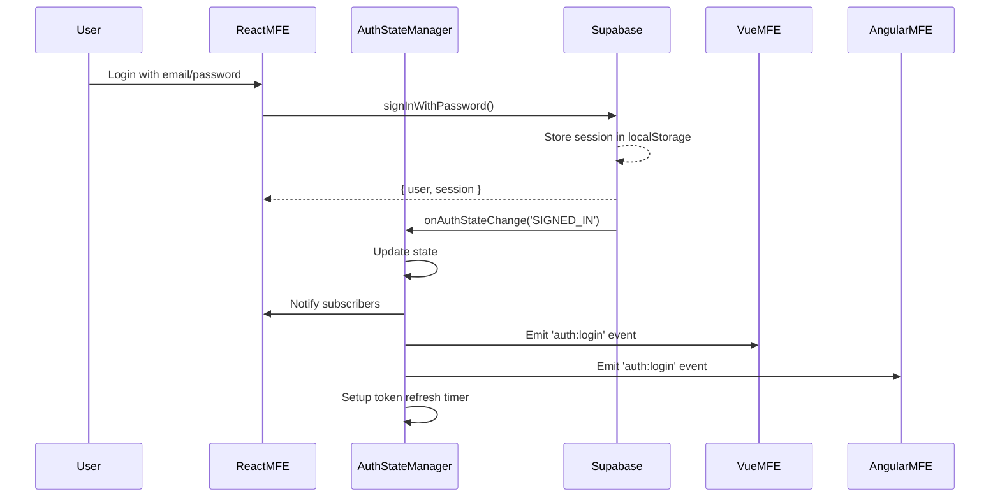
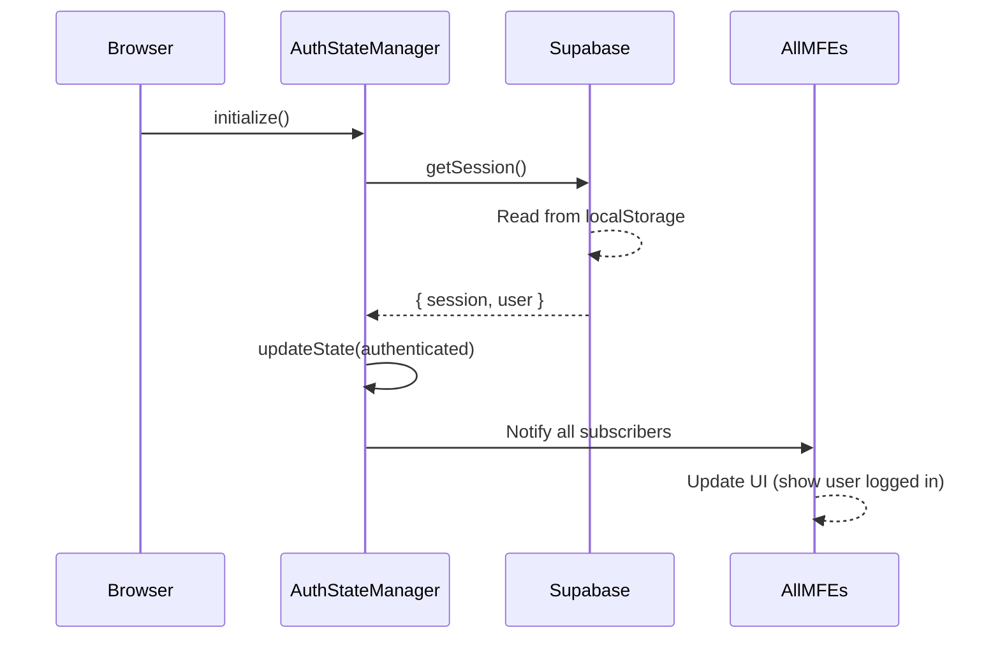
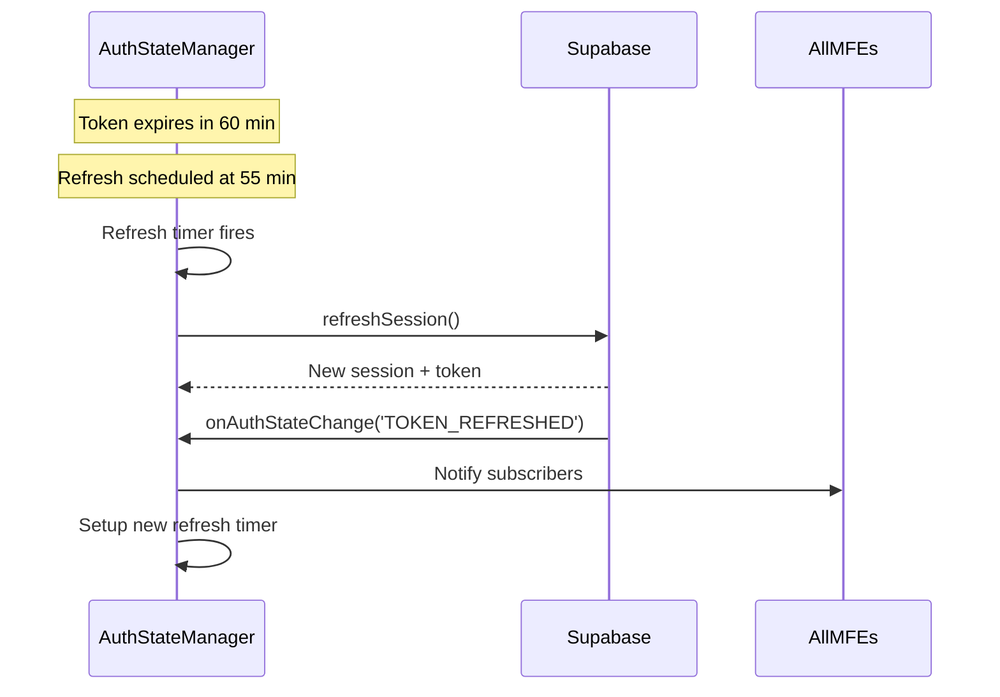
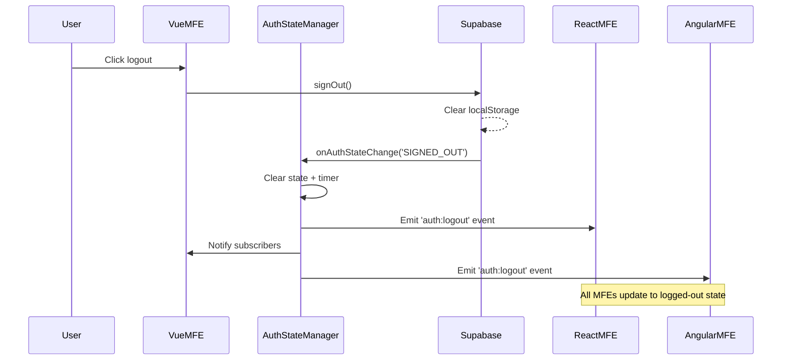

# Cross-MFE Session Management Implementation

## ✅ Completed

### 1. AuthStateManager (`packages/shared-library/src/auth/AuthStateManager.ts`)

**Centralized authentication state manager** for all MFEs

**Features:**
- ✅ Single source of truth for auth state across all micro-frontends
- ✅ Session persistence via Supabase localStorage
- ✅ Automatic token refresh (5 minutes before expiry)
- ✅ Cross-MFE state synchronization via EventBus
- ✅ Typed callbacks for auth state changes
- ✅ Handles: `SIGNED_IN`, `SIGNED_OUT`, `TOKEN_REFRESHED`, `USER_UPDATED` events

**API:**
```typescript
interface AuthState {
  user: User | null;
  session: Session | null;
  loading: boolean;
  isAuthenticated: boolean;
}

// Subscribe to auth changes
const unsubscribe = authStateManager.subscribe((state: AuthState) => {
  console.log('Auth state changed:', state);
});

// Get current state (sync)
const state = authStateManager.getState();

// Get user/session (async, waits for initialization)
const user = await authStateManager.getUser();
const session = await authStateManager.getSession();

// Manual refresh
await authStateManager.refresh();
```

### 2. Updated SupabaseAuth (`packages/shared-library/src/auth/SupabaseAuth.ts`)

**Added session management methods:**
- ✅ `getCurrentUser()` - Returns `{ user, session, error }` for state restoration
- ✅ `onAuthStateChange(callback)` - Already existed, used by AuthStateManager
- ✅ `refreshSession()` - Manual session refresh

### 3. React useAuth Hook (`packages/react-mfe/src/hooks/useAuth.ts`)

**React integration for AuthStateManager**

**Features:**
- ✅ Subscribes to AuthStateManager automatically
- ✅ Provides user, session, loading, isAuthenticated
- ✅ Provides login, logout, refresh, getUser, getSession methods
- ✅ Automatically re-renders on auth state changes

**Usage:**
```tsx
import { useAuth } from './hooks/useAuth';

function MyComponent() {
  const { user, isAuthenticated, loading, logout } = useAuth();

  if (loading) return <div>Loading...</div>;
  
  if (!isAuthenticated) {
    return <div>Please log in</div>;
  }

  return (
    <div>
      <h1>Welcome {user?.email}</h1>
      <button onClick={logout}>Logout</button>
    </div>
  );
}
```

### 4. Global Initialization (`packages/shared-library/src/index.ts`)

**AuthStateManager auto-initializes on load:**
- ✅ Creates singleton instance
- ✅ Initializes automatically in browser environment
- ✅ Exposed via `globalThis.sharedServices.authStateManager`
- ✅ Restores session from localStorage on startup

---

## 🎯 How It Works

### Authentication Flow



### Session Restoration on Page Load



### Automatic Token Refresh



### Cross-MFE Logout Propagation



---

## 📋 Next Steps

### TODO: React MFE Integration
- [ ] Update `AuthContext` to use `useAuth` hook instead of local state
- [ ] Remove duplicate auth logic from `AuthProvider`
- [ ] Update `LoginForm` to use `useAuth().login()`
- [ ] Update `RegisterForm` to use auth state manager
- [ ] Test session persistence after page refresh

### TODO: Vue MFE Integration
- [ ] Create `useAuth.ts` composable (Vue 3 Composition API)
- [ ] Subscribe to AuthStateManager in composable
- [ ] Add protected route guards using auth state
- [ ] Test cross-MFE navigation (React → Vue)

### TODO: Angular MFE Integration
- [ ] Create `AuthService` (Angular service)
- [ ] Wrap AuthStateManager with RxJS observables
- [ ] Create `AuthGuard` for protected routes
- [ ] Add session restoration in `app.component.ts`
- [ ] Test cross-MFE navigation (React → Angular)

### TODO: Testing
- [ ] Test: Login in React → Navigate to Vue → Verify logged in
- [ ] Test: Login in React → Refresh page → Still logged in
- [ ] Test: Logout in Vue → React updates to logged out
- [ ] Test: Token refresh after 55 minutes
- [ ] Test: Multiple tabs - logout in one, others update

---

## 🔑 Key Concepts

### 1. **Centralized State**
   - AuthStateManager is the **single source of truth**
   - All MFEs subscribe to same state
   - No duplicate auth logic across MFEs

### 2. **Event-Driven Architecture**
   - Uses EventBus for cross-MFE communication
   - Events: `auth:login`, `auth:logout`, `auth:session_restored`, `auth:user_updated`
   - All MFEs listen to same events

### 3. **Framework-Agnostic Core**
   - AuthStateManager doesn't depend on React/Vue/Angular
   - Each framework gets its own wrapper (hook/composable/service)
   - Core logic shared, UI integration framework-specific

### 4. **Automatic Session Management**
   - Session persisted in localStorage by Supabase
   - Auto-restored on page load
   - Auto-refreshed before expiry
   - Auto-cleared on logout

### 5. **Type Safety**
   - Full TypeScript typing
   - Supabase types imported: `User`, `Session`, `AuthError`
   - Custom types: `AuthState`, `AuthResponse`

---

## 🚀 Production Readiness

### Current Status: **Foundation Complete** ✅

**What's Ready:**
- ✅ Core AuthStateManager implementation
- ✅ Session persistence and restoration
- ✅ Automatic token refresh
- ✅ Cross-MFE event synchronization
- ✅ React hook implementation
- ✅ TypeScript types
- ✅ Error handling

**What's Needed:**
- 🟡 Integration with existing React AuthContext
- 🟡 Vue composable
- 🟡 Angular service
- 🟡 End-to-end testing
- 🟡 Documentation for each MFE

### Estimated Time to Complete:
- React integration: **30 minutes**
- Vue composable: **45 minutes**
- Angular service: **1 hour**
- Testing: **30 minutes**

**Total: ~2.5-3 hours to production-ready state**

---

## 📚 Documentation

### For Developers Using This System:

1. **React MFE**: Use `useAuth()` hook
2. **Vue MFE**: Use `useAuth()` composable (to be created)
3. **Angular MFE**: Inject `AuthService` (to be created)

All frameworks get the same API:
```typescript
{
  user: User | null,
  session: Session | null,
  loading: boolean,
  isAuthenticated: boolean,
  login: (email, password) => Promise<Result>,
  logout: () => Promise<Result>,
  refresh: () => Promise<Result>
}
```

### Architecture Benefits:

1. **No Props Drilling**: Auth state available everywhere
2. **No Redux Needed**: Built-in state management
3. **Framework Agnostic**: Works with any UI framework
4. **Automatic Updates**: All components re-render on auth change
5. **Token Management**: Never manually manage tokens
6. **Type Safe**: Full TypeScript support

---

## 🎓 Example Usage Across MFEs

### React MFE
```tsx
import { useAuth } from './hooks/useAuth';

function Dashboard() {
  const { user, logout } = useAuth();
  return <button onClick={logout}>Logout {user?.email}</button>;
}
```

### Vue MFE (Future)
```vue
<script setup>
import { useAuth } from './composables/useAuth';
const { user, logout } = useAuth();
</script>

<template>
  <button @click="logout">Logout {{ user?.email }}</button>
</template>
```

### Angular MFE (Future)
```typescript
import { AuthService } from './services/auth.service';

@Component({...})
export class DashboardComponent {
  user$ = this.auth.user$;
  
  constructor(private auth: AuthService) {}
  
  logout() {
    this.auth.logout();
  }
}
```

---

## ✨ Summary

We've built a **production-grade, framework-agnostic session management system** that:
- Persists sessions across page refreshes
- Synchronizes auth state across all MFEs
- Automatically refreshes tokens
- Provides simple, consistent API
- Works with Supabase authentication
- Fully typed with TypeScript

**Next**: Integrate with each MFE's UI layer and test the complete flow.
